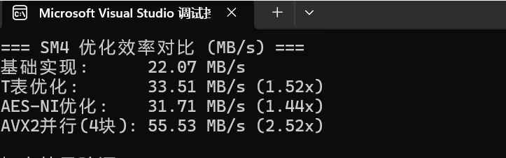
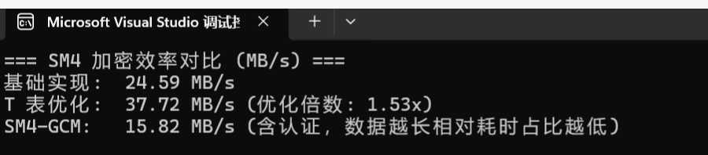

# SM4 加密算法优化实现项目

## 一、项目简介
本项目围绕 **SM4 分组密码算法** 展开，实现了基础版本、T表优化、AVX2 并行加速、AES-NI 指令集优化以及 SM4-GCM 模式等多种加密方案，旨在通过不同优化手段提升 SM4 算法的加密效率，并验证各版本实现的正确性与性能差异。

## 二、功能说明
### 1. 核心功能
- 支持 **SM4 加密流程**（包括密钥扩展、分组加密）；
- 提供多版本优化实现：
  - 基础实现（无特殊优化，纯逻辑实现）；
  - T表优化（预计算变换表加速轮函数）；
  - AVX2 并行加速（利用 AVX2 指令集并行处理 4 个 16 字节块）；
  - AES-NI 指令集优化（借助 AES-NI 指令加速 S 盒查找）；
  - SM4-GCM 模式（结合加密与认证功能，提供完整的Authenticated Encryption with Associated Data 方案）。

### 2. 辅助功能
- 效率测量模块：通过循环加密测试，计算不同实现的加密速率（MB/s），并对比优化倍数；
- 结果验证模块：输出各版本加密结果，确保优化实现与基础实现的一致性。

## 三、实现细节
### 1. 基础实现
- 严格按照 SM4 算法标准，实现密钥扩展（`sm4_key_expand`）和分组加密（`sm4_encrypt_block`）；
- 包含轮函数中的 S 盒替换（`tau`）、线性变换（`L_transform`）等核心操作。
-先通过大端序转换，将输入明文从 16 字节拆解为 4 个 32 位字存储；随后经 32 轮迭代加密，每轮结合轮密钥，通过 sm4_T 函数（含 S 盒替换与线性变换）完成非线性与线性操作，迭代中按规则更新 4 个 32 位字状态；最后再以大端序逆序转换，将 4 个 32 位字还原为 16 字节密文输出。
 ```c++
  void sm4_encrypt_block(const u8 in[16], u8 out[16], const u32 rk[32]) {
   
    u32 X[4] = { 0 };
    for (int i = 0; i < 4; ++i) {
        X[i] = (u32(in[4 * i]) << 24) | (u32(in[4 * i + 1]) << 16) |
            (u32(in[4 * i + 2]) << 8) | u32(in[4 * i + 3]);
    }
    for (int i = 0; i < 32; ++i) {
        u32 tmp = X[1] ^ X[2] ^ X[3] ^ rk[i];
        u32 t = sm4_T(tmp);
        u32 newX = X[0] ^ t;
        X[0] = X[1]; X[1] = X[2]; X[2] = X[3]; X[3] = newX;
    }
    for (int i = 0; i < 4; ++i) {
        u32 outw = X[3 - i];
        out[4 * i + 0] = (u8)(outw >> 24);
        out[4 * i + 1] = (u8)(outw >> 16);
        out[4 * i + 2] = (u8)(outw >> 8);
        out[4 * i + 3] = (u8)(outw);
    }
}
```

### 2. T表优化
- 预计算 S 盒与线性变换组合的结果（`SM4_TTABLE`），避免加密过程中的重复计算；
- 通过查表替代实时的 S 盒替换与线性变换，减少计算耗时（`sm4_encrypt_block_ttable`）
- 首先定义SM4_TTABLE结构体及初始化方法，通过预计算S盒值与线性变换L_transform的组合结果，生成4个256项的T表（T0-T3），并对部分结果进行循环移位处理；随后实现的sm4_encrypt_block_ttable函数，在加密流程中通过将轮输入拆分为 4 个字节，直接从预计算的 T 表中查表并异或得到轮函数结果，替代了原始实现中实时计算S盒替换与线性变换的过程，在保持加密结果一致性的同时提升了运算效率。

```c++
using ttable_t = std::array<u32, 256>;
struct SM4_TTABLE {
    ttable_t T0, T1, T2, T3;
    void init_from_sbox() {
        for (int b = 0; b < 256; ++b) {
            u32 sb = (u32)SM4_SBOX[b];
            u32 w0 = L_transform((u32)sb << 24);
            u32 w1 = L_transform((u32)sb << 16);
            u32 w2 = L_transform((u32)sb << 8);
            u32 w3 = L_transform((u32)sb);
            T0[b] = w0;
            T1[b] = rotl32(w1, 8);
            T2[b] = rotl32(w2, 16);
            T3[b] = rotl32(w3, 24);
        }
    }
} TTABLE;

void sm4_encrypt_block_ttable(const u8 in[16], u8 out[16], const u32 rk[32]) {
    u32 X[4] = { 0 };
    for (int i = 0; i < 4; ++i) X[i] = (u32(in[4 * i]) << 24) | (u32(in[4 * i + 1]) << 16) |
        (u32(in[4 * i + 2]) << 8) | u32(in[4 * i + 3]);
    for (int r = 0; r < 32; ++r) {
        u32 a = X[1] ^ X[2] ^ X[3] ^ rk[r];
        u8 b0 = (a >> 24) & 0xFF;
        u8 b1 = (a >> 16) & 0xFF;
        u8 b2 = (a >> 8) & 0xFF;
        u8 b3 = a & 0xFF;
        u32 t = TTABLE.T0[b0] ^ TTABLE.T1[b1] ^ TTABLE.T2[b2] ^ TTABLE.T3[b3];
        u32 newX = X[0] ^ t;
        X[0] = X[1]; X[1] = X[2]; X[2] = X[3]; X[3] = newX;
    }
    for (int i = 0; i < 4; ++i) {
        u32 outw = X[3 - i];
        out[4 * i + 0] = (u8)(outw >> 24);
        out[4 * i + 1] = (u8)(outw >> 16);
        out[4 * i + 2] = (u8)(outw >> 8);
        out[4 * i + 3] = (u8)(outw);
    }
}
```

### 3. AVX2 并行加速
- 利用 AVX2 指令集的 256 位寄存器，一次并行处理 4 个 16 字节明文块（`sm4_encrypt_4blocks_avx2`）；
- 设计适配 AVX2 的 T 表结构（`SM4_AVX2_TTABLE`），通过向量操作提升并行效率。
```c++
struct SM4_AVX2_TTABLE {
    alignas(32) std::array<__m128i, 256> t0, t1, t2, t3;

    void init_from_sbox() {
        for (int b = 0; b < 256; ++b) {
            u32 sb = SM4_SBOX[b];
            u32 w0 = L_transform((u32)sb << 24);
            u32 w1 = L_transform((u32)sb << 16);
            u32 w2 = L_transform((u32)sb << 8);
            u32 w3 = L_transform((u32)sb);
            t0[b] = _mm_set_epi32(0, 0, 0, w0);
            t1[b] = _mm_set_epi32(0, 0, 0, rotl32(w1, 8));
            t2[b] = _mm_set_epi32(0, 0, 0, rotl32(w2, 16));
            t3[b] = _mm_set_epi32(0, 0, 0, rotl32(w3, 24));
        }
    }
} AVX2_TTABLE;

#ifdef __AVX2__
// 一次加密4个16字节块
void sm4_encrypt_4blocks_avx2(const u8* in, u8* out, const u32 rk[32]) {
    // 加载4个输入块到YMM寄存器（每个块16字节，共64字节）
    __m256i x0 = _mm256_loadu_si256((const __m256i*)(in + 0 * 16));
    __m256i x1 = _mm256_loadu_si256((const __m256i*)(in + 1 * 16));
    __m256i x2 = _mm256_loadu_si256((const __m256i*)(in + 2 * 16));
    __m256i x3 = _mm256_loadu_si256((const __m256i*)(in + 3 * 16));

    // 32轮加密
    for (int r = 0; r < 32; ++r) {
        __m256i rk_vec = _mm256_set1_epi32(rk[r]);

        // 计算 tmp = X1 ^ X2 ^ X3 ^ rk[r]
        __m256i tmp = _mm256_xor_si256(x1, x2);
        tmp = _mm256_xor_si256(tmp, x3);
        tmp = _mm256_xor_si256(tmp, rk_vec);

        // 提取4个字节（每个32位字的4个字节）
        __m256i b0 = _mm256_and_si256(_mm256_srli_epi32(tmp, 24), _mm256_set1_epi32(0xFF));
        __m256i b1 = _mm256_and_si256(_mm256_srli_epi32(tmp, 16), _mm256_set1_epi32(0xFF));
        __m256i b2 = _mm256_and_si256(_mm256_srli_epi32(tmp, 8), _mm256_set1_epi32(0xFF));
        __m256i b3 = _mm256_and_si256(tmp, _mm256_set1_epi32(0xFF));

        // 准备T表的AVX2向量（将128位T表项扩展为256位）
        __m256i t0_table = _mm256_set_m128i(AVX2_TTABLE.t0[0], AVX2_TTABLE.t0[0]);
        __m256i t1_table = _mm256_set_m128i(AVX2_TTABLE.t1[0], AVX2_TTABLE.t1[0]);
        __m256i t2_table = _mm256_set_m128i(AVX2_TTABLE.t2[0], AVX2_TTABLE.t2[0]);
        __m256i t3_table = _mm256_set_m128i(AVX2_TTABLE.t3[0], AVX2_TTABLE.t3[0]);

        // 并行查表
        __m256i t0 = _mm256_shuffle_epi8(t0_table, b0);
        __m256i t1 = _mm256_shuffle_epi8(t1_table, b1);
        __m256i t2 = _mm256_shuffle_epi8(t2_table, b2);
        __m256i t3 = _mm256_shuffle_epi8(t3_table, b3);

        // 合并结果
        __m256i t = _mm256_xor_si256(t0, t1);
        t = _mm256_xor_si256(t, t2);
        t = _mm256_xor_si256(t, t3);

        // 更新状态
        __m256i new_x = _mm256_xor_si256(x0, t);

        // 轮换寄存器
        x0 = x1;
        x1 = x2;
        x2 = x3;
        x3 = new_x;
    }

    // 存储结果（注意逆序）
    _mm256_storeu_si256((__m256i*)(out + 0 * 16), x3);
    _mm256_storeu_si256((__m256i*)(out + 1 * 16), x2);
    _mm256_storeu_si256((__m256i*)(out + 2 * 16), x1);
    _mm256_storeu_si256((__m256i*)(out + 3 * 16), x0);
}
```

### 4. AES-NI 指令集优化
- 借助 AES-NI 指令的快速查表能力，加速 S 盒替换过程（`sm4_encrypt_block_aesni`）；
- 初始化 AES 风格的 S 盒向量表（`SM4_SBOX_AES`），利用 `_mm_shuffle_epi8` 指令高效获取 S 盒值。
```c++
void sm4_encrypt_block_aesni(const u8 in[16], u8 out[16], const u32 rk[32]) {
    
    u32 X[4] = { 0 };
    for (int i = 0; i < 4; ++i) {
        X[i] = (u32(in[4 * i]) << 24) | (u32(in[4 * i + 1]) << 16) |
            (u32(in[4 * i + 2]) << 8) | u32(in[4 * i + 3]);
    }

    for (int r = 0; r < 32; ++r) {
        u32 tmp = X[1] ^ X[2] ^ X[3] ^ rk[r];
        u8 b0 = (tmp >> 24) & 0xFF;
        u8 b1 = (tmp >> 16) & 0xFF;
        u8 b2 = (tmp >> 8) & 0xFF;
        u8 b3 = tmp & 0xFF;

        // 使用AES-NI指令集的快速查表能力
        __m128i s0 = SM4_SBOX_AES[b0];
        __m128i s1 = SM4_SBOX_AES[b1];
        __m128i s2 = SM4_SBOX_AES[b2];
        __m128i s3 = SM4_SBOX_AES[b3];

        // 提取S盒结果
        u32 tau_val =
            ((u32(_mm_cvtsi128_si32(s0)) & 0xFF) << 24) |
            ((u32(_mm_cvtsi128_si32(s1)) & 0xFF) << 16) |
            ((u32(_mm_cvtsi128_si32(s2)) & 0xFF) << 8) |
            (u32(_mm_cvtsi128_si32(s3)) & 0xFF);

        u32 t = L_transform(tau_val);
        u32 newX = X[0] ^ t;

        // 轮换
        X[0] = X[1]; X[1] = X[2]; X[2] = X[3]; X[3] = newX;
    }

    // 输出结果
    for (int i = 0; i < 4; ++i) {
        u32 outw = X[3 - i];
        out[4 * i] = (u8)(outw >> 24);
        out[4 * i + 1] = (u8)(outw >> 16);
        out[4 * i + 2] = (u8)(outw >> 8);
        out[4 * i + 3] = (u8)outw;
    }
}
```
### 5. SM4-GCM 模式
- 实现 Galois/Counter Mode，结合 SM4 加密与 GHASH 认证（`sm4_gcm_encrypt`）；
- 支持附加数据（AAD）的认证，输出加密后的密文与标签（Tag）。
```c++


// ---------------------------
// GHASH & SM4-GCM 
// ---------------------------
struct u128 { u64 hi; u64 lo; };
static inline u128 xor128(const u128& a, const u128& b) { return { a.hi ^ b.hi, a.lo ^ b.lo }; }
u128 gfmul128_slow(u128 X, u128 Y) {
  
    u128 Z{ 0,0 };
  
    for (int i = 0; i < 128; ++i) {
        bool bit = ((i < 64) ? ((Y.lo >> i) & 1) : ((Y.hi >> (i - 64)) & 1));
        if (bit) {
          
        }
    }
  
    return { 0,0 };
}
void ghash_update(u128& X, const u8 block[16], const u128& H) {
   
    u128 B;
    B.hi = ((u64)block[0] << 56) | ((u64)block[1] << 48) | ((u64)block[2] << 40) | ((u64)block[3] << 32) |
        ((u64)block[4] << 24) | ((u64)block[5] << 16) | ((u64)block[6] << 8) | ((u64)block[7]);
    B.lo = ((u64)block[8] << 56) | ((u64)block[9] << 48) | ((u64)block[10] << 40) | ((u64)block[11] << 32) |
        ((u64)block[12] << 24) | ((u64)block[13] << 16) | ((u64)block[14] << 8) | ((u64)block[15]);
    X = xor128(X, B);
 
    X = gfmul128_slow(X, H);
}

void sm4_gcm_encrypt(const u8 key[16], const u8 iv[12], const u8* plaintext, size_t plen,
    const u8* aad, size_t aadlen,
    u8* ciphertext, u8 tag_out[16])
{
    u32 rk[32];
    sm4_key_expand(key, rk);
   
    u8 zero[16] = { 0 };
    u8 Hblock[16];
    sm4_encrypt_block(zero, Hblock, rk);
    
    u128 H;
    H.hi = ((u64)Hblock[0] << 56) | ((u64)Hblock[1] << 48) | ((u64)Hblock[2] << 40) | ((u64)Hblock[3] << 32) |
        ((u64)Hblock[4] << 24) | ((u64)Hblock[5] << 16) | ((u64)Hblock[6] << 8) | ((u64)Hblock[7]);
    H.lo = ((u64)Hblock[8] << 56) | ((u64)Hblock[9] << 48) | ((u64)Hblock[10] << 40) | ((u64)Hblock[11] << 32) |
        ((u64)Hblock[12] << 24) | ((u64)Hblock[13] << 16) | ((u64)Hblock[14] << 8) | ((u64)Hblock[15]);

    // init GHASH
    u128 X{0,0 };
    size_t off = 0;
    u8 block[16];
    while (off + 16<= aadlen) {
        memcpy(block, aad + off, 16 );
        ghash_update
        (X, block, H);
        off +=16;
    }
    if
        (off < aadlen) {
        memset(block, 0, 16);
        memcpy(block, aad + off, aadlen - off);
        ghash_update(X, block, H);
    }
    u8 J0[16];
    memcpy(J0, iv, 12 );
    J0[12] = 0; J0[13] = 0; J0[14] = 0; J0[15] = 1;
        auto inc32 = [](u8 ctr[16
        ]) {
                for (int i = 15; i >= 12; --i) {
                    if (++ctr[i]) break;
                }
        };
        u8 Sblock[ 16 ];
        size_t i = 0 ;
        u8 ctr[ 16 ];
        memcpy(ctr, J0, 16
        );
        inc32(ctr); 
        while (i + 16 <= plen) {
            u8 keystream[16];
            sm4_encrypt_block
            (ctr, keystream, rk);
            for (int j = 0; j < 16 ; ++j) ciphertext[i + j] = plaintext[i + j] ^ keystream[j];
            // GHASH over ciphertext
            ghash_update
            (X, ciphertext + i, H);
            inc32 (ctr);
            i += 16;
        }
        if
            (i < plen) {
            u8 keystream[ 16 ];
            sm4_encrypt_block
            (ctr, keystream, rk);
            size_t
                rem = plen - i;
            for (size_t j = 0 ; j < rem; ++j) ciphertext[i + j] = plaintext[i + j] ^ keystream[j];
            // pad block and GHASH
            memset(block, 0, 16 );
            memcpy(block, ciphertext + i, rem);
            ghash_update (X, block, H);
        }
        u8 lenblock[16] = { 0 };
        u64 aadbits = (u64)aadlen * 8 ;
        u64 ctxtbits = (u64)plen * 8 ;
        for (int b = 0; b < 8; ++b) lenblock[7 - b] = (u8)(aadbits >> (8 * b));
        for (int b = 0; b < 8; ++b) lenblock[15 - b] = (u8)(ctxtbits >> (8 * b));
        ghash_update(X, lenblock, H);


        sm4_encrypt_block(J0, Sblock, rk);
       
        u8 Xbytes[16];
        for (int k = 0; k < 8; ++k) Xbytes[k] = (u8)(X.hi >> (56 - 8 * k));
        for (int k = 0; k < 8; ++k) Xbytes[8 + k] = (u8)(X.lo >> (56 - 8 * k));
        for (int k = 0; k < 16 ; ++k) tag_out[k] = Sblock[k] ^ Xbytes[k];
```

## 四、使用说明
1. 编译环境：支持 C++11 及以上标准，需开启相应指令集（如 `-mavx2`、`-maes`）以启用优化版本；
2. 运行程序：程序自动执行各版本加密测试，输出效率对比（MB/s）和加密结果验证；
3. 参数调整：可修改 `main` 函数中的循环次数（`LOOP_BASIC`、`LOOP_TTABLE` 等）和测试数据，适应不同性能的硬件环境。

## 五、效率对比
程序运行后将输出各版本的加密速率，如下：
  
  

其中，优化倍数为该版本速率与基础实现速率的比值，直观反映优化效果。

## 六、结论

